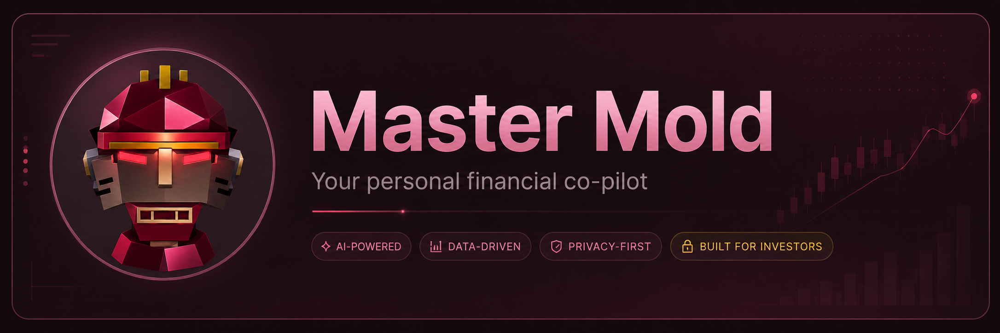

# Master Mold



Master Mold is a local-first AI investing console with a Solana/Web3 autopilot
lane. It pairs portfolio review, daily briefings, journal, and chat with a bot
cockpit that watches live Solana markets and proves itself in paper mode. The
public repository ships with synthetic sample data only.

The draw is the paper-to-live path for autonomous Web3 trading: Master Mold
tracks a liquid Solana universe, records the bot's decisions, rehearses Jupiter
routes against live DEX quotes, and keeps any live swap behind local wallet
provisioning, hard caps, a kill switch, and an evidence-based go-live gate.
Today, the public build is paper-first and advisory by default. It never places
brokerage trades, and Solana execution stays off unless a spare local wallet is
deliberately provisioned and the go-live gate passes.

Master Mold does not include a live portfolio, brokerage account, wallet
authority, or personal account history. If you connect your own accounts, add
notes, or provision a Solana wallet locally, that state belongs in ignored
storage such as `.data/`, `.env.local`, `engine/.env`, or another local-only
workspace.

## What Ships

- A Next.js App Router app with `/api/health`, a review surface, and a local
  dashboard for portfolio context.
- Synthetic sample holdings and sample activity so the app can be reviewed
  before any account is connected.
- Read-only portfolio import surfaces for credentials you provide locally.
- A Solana/Web3 Autopilot page for SOL, JUP, BONK, WIF, JTO, WETH, WBTC, RAY,
  and PYTH, with live market watching, paper equity, decision logs, caps, a kill
  switch, wallet readiness, and a go-live gate.
- Guarded Solana execution plumbing for the operator path: Jupiter quote/swap
  building, local wallet signing from ignored environment variables, Solana RPC
  resolution, and a Helius credit firewall.
- Local stores under `.data/` for imported holdings, notes, reports, paper bot
  state, and other user-created data.

The default bot mode is paper. Live Solana execution is not the public default;
it requires local wallet provisioning, passing go-live evidence, and deliberate
operator action.

## Privacy Boundary

Tracked files are code, public docs, assets, tests, and synthetic sample data.

Ignored local files are where personal state belongs:

- `.data/` for app databases, imported holdings, journals, reports, and bot state.
- `.env.local` and `engine/.env` for local secrets.
- `engine/out/` for generated engine output.
- `artifacts/`, `screenshots/`, `reports/private/`, and `docs/private/` for local review material.

Before publishing, pushing, or preparing a release, run:

```bash
npm run privacy:audit
```

## Quick Start

```bash
bun install
bun run dev
```

Open http://localhost:4002. The app pins port 4002 so the daily-run script,
scheduler templates, and integration tests line up without configuration. The
app starts in sample mode and runs without external accounts, API keys, or a
wallet. Connecting accounts or preparing a Solana wallet is optional and must
use local, ignored configuration only.

Two optional processes deepen the experience once the app runs:

```bash
npm run autopilot   # the Solana paper-bot daemon (arm it from the Autopilot page)
npm run daily       # one proactive daily read (the app also self-schedules a
                    # morning read while the server is running)
```

Production-style `npm run start` requires Node 22.5 or newer; local development
uses Bun's built-in SQLite support.

## Optional Local Configuration

Use `.env.local` for app settings and `engine/.env` for engine settings. Start
from the example files and keep real values out of git.

```bash
cp .env.example .env.local
cd engine && cp .env.example .env
```

Common local paths:

```bash
MASTERMOLD_DB=.data/mastermold.db
AUTOPILOT_DB=.data/autopilot.db.json
ENGINE_OUT_DIR=engine/out
```

Three separate surfaces read LLM keys — set only what you use:

- Chat: `ANTHROPIC_API_KEY`, `OPENROUTER_API_KEY`, or `OPENAI_API_KEY` in
  `.env.local` (restart the server after changing them), or paste a
  browser-scoped key in Settings → Chat.
- Today-page play refinement and the autopilot's daily Analyst:
  `OPENROUTER_API_KEY` in `.env.local`. Without it the Analyst runs a built-in
  rule-based review, so the learning loop still works.
- The Python briefing engine: its own keys in `engine/.env`. The engine is
  optional; to enable richer daily scans, set it up once with
  `cd engine && uv venv && uv pip install -e .` (see `engine/README.md`).

Monarch Money import is available through a local MCP server: set
`MONARCH_MCP_COMMAND` (stdio) or `MONARCH_MCP_URL` (HTTP) in `.env.local`.

Optional Web3 settings are also local-only:

```bash
SOLANA_RPC_URL=
HELIUS_ENABLED=false
HELIUS_API_KEY=
AUTOPILOT_WALLET_SECRET=
```

`AUTOPILOT_WALLET_SECRET` is for a spare Solana wallet, never a primary wallet,
and should stay out of git. Use the paper lane first; the live path is intended
for reviewed canary execution after the bot has earned it.

## Development

```bash
bun run typecheck
bun test tests
npm run privacy:audit
npm run smoke:app
```

`npm run smoke:app` expects a local app server to be running.

## Repository Map

```text
app/                 Next.js pages and API routes
components/          UI components
src/db/              Local app store, sample data, portfolio imports, reports
src/chat/            Chat providers, context, and bounded local actions
src/autopilot/       Solana/Web3 paper bot, go-live gate, and executor logic
src/helius/          Optional Helius/Solana RPC credit firewall
engine/              Optional Python briefing engine
public/              Public app assets
scripts/             Local helper and verification scripts
tests/               Unit and source-contract tests
docs/                Public documentation only
```

## Documentation

- [Docs index](docs/README.md)
- [Architecture](docs/ARCHITECTURE.md)
- [Privacy](docs/PRIVACY.md)
- [Security](docs/SECURITY.md)
- [Deployment](docs/DEPLOYMENT.md)

## License

This is a public source release. A formal open-source license has not been
selected yet; until a `LICENSE` file is added, do not assume redistribution,
commercial-use, or reuse rights beyond viewing and local evaluation.
