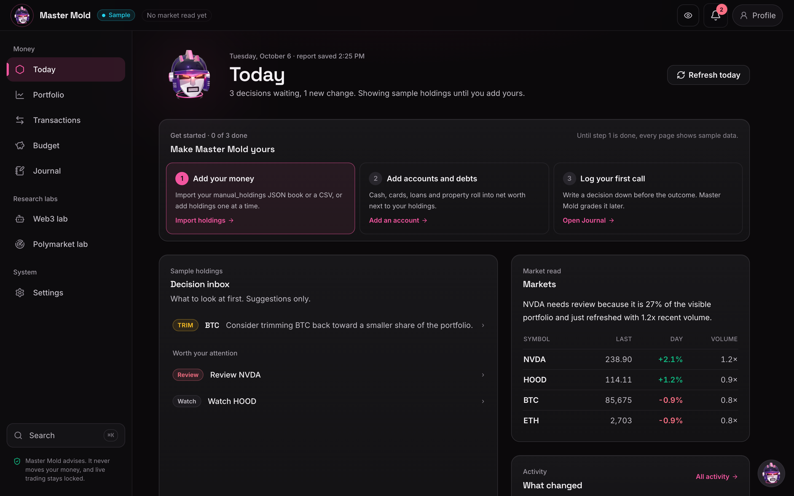
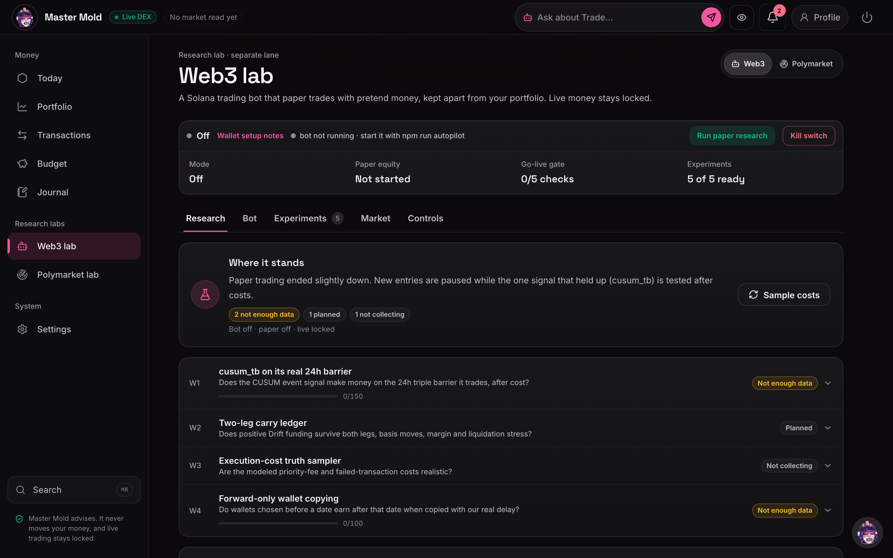

# Master Mold

<p align="center">
  <strong>A local-first money hub with a Solana trading bot that has to earn its way to live.</strong><br>
  Net worth, holdings, budget, and a decision journal on your own machine, plus Web3 and Polymarket research labs
  that paper trade against live markets behind hard caps, a kill switch, and an evidence gate.
</p>

<p align="center">
  
  
  
  
  
  
  <a href="https://discord.gg/xwHfUD2bxW"></a>
</p>



*Today on the built-in sample data. Nothing here is a real account.*

**[What it is](#what-is-master-mold) · [Status](#current-status) · [Get it running](#get-it-running) ·
[The labs](#the-research-labs) · [FAQ](#frequently-asked-questions) · [Discord](https://discord.gg/xwHfUD2bxW)**

> [!IMPORTANT]
> **Advice, not autopilot, by default.** Master Mold never places brokerage trades. Both bot lanes start
> off. Paper mode needs a deliberate local action, and live Solana swaps stay locked unless you provision
> a spare wallet yourself and the go-live gate passes.
>
> **Your data stays local.** The repository ships synthetic sample data only and does not include a live portfolio,
> brokerage account, wallet authority, or account history. Anything you add lives in git-ignored storage on
> your machine (`.data/`, `.env.local`, `engine/.env`).
>
> **AI disclosure:** Master Mold is developed with substantial AI assistance. The in-app
> [What works today](#current-status) page records what is real, sample, credential-gated, or missing.

## What's new

- **Quiet instrument redesign.** Graphite surfaces, one magenta signal, quiet labels, and color reserved
  for state. The thesis lives in [docs/DESIGN.md](docs/DESIGN.md).
- **Sub-cent prices are kept.** Tokens priced below a cent (meme coins, for example) used to save as `$0`
  and drop out of net worth. Prices now keep their significant digits on every import path.
- **Safer edge cases.** Adding a holding with a bad cost basis no longer saves a half-written duplicate,
  malformed requests get a clear error instead of a crash, and `npm run dev` explains an old Node version
  instead of failing with `bad option`.

## What is Master Mold?

Master Mold is two things that stay deliberately apart.

**A money hub.** Today gives you a short daily read and a ranked decision inbox. Portfolio covers holdings,
accounts, cash, debts, and property, so net worth is assets minus debts. Transactions and Budget handle
spending, and the Journal records calls before the outcome so they can be graded later. A chat assistant
explains any of it and can open pages for you. It never trades.

**Research labs.** The Web3 lab runs a Solana bot over a liquid universe (SOL, JUP, BONK, WIF, JTO, WETH,
WBTC, RAY, PYTH). It watches live DEX markets, rehearses Jupiter routes against real quotes, logs every
decision, and proves itself in paper mode. The Polymarket lab samples executable order books, tests
hypotheses in shadow mode, and grades forecasts against final outcomes. Neither lab touches your money.



## Current status

| Area | State |
| --- | --- |
| Today, Portfolio, Transactions, Budget, Journal | Working on sample data or your local entries |
| Holdings import | Working: `manual_holdings` JSON, CSV with column mapping, or one at a time, with preview and undo |
| Chat | Working with an OpenCode Go or OpenRouter key; explains and navigates only |
| Market read | Optional Python engine; the app runs without it |
| Monarch Money import | Credential-gated through a local MCP server |
| Web3 lab | Paper trading and research; live swaps locked behind wallet provisioning and the go-live gate |
| Polymarket lab | Public market reads, paper simulator, shadow research; live orders are not built |

Open `/review` in the app for the full, current breakdown.

## Get it running

You need [Bun](https://bun.sh) and Node 22.5 or newer.

```bash
git clone https://github.com/chrissotraidis/mastermold.git
cd mastermold
bun install
bun run dev
```

Open http://localhost:4002. The first visit shows a short welcome; every page uses clearly labeled sample
data until you add your own. No accounts, keys, or wallet are needed to look around.

To run the web app and the Solana paper-bot daemon together, supervised and restarted on failure:

```bash
npm run up
```

### Make it yours

1. **Add your money.** Portfolio, then Import, accepts the `manual_holdings` JSON book as-is, a CSV, or
   one holding at a time.
2. **Add accounts and debts.** Brokerages, wallets, banks, cards, loans, mortgages, and property.
3. **Log your first call** in Journal before the outcome is known.

## The research labs

The bot mode is off by default. Arm paper mode from the Web3 lab, then start the daemon with
`npm run autopilot`. Live Solana execution additionally requires:

- a spare wallet's key in `.env.local` (`AUTOPILOT_WALLET_SECRET`), never your primary wallet,
- passing go-live evidence from the paper lane,
- a deliberate operator action, with hard caps and a kill switch always available.

The Polymarket lab has no live order path. New hypotheses stay shadow-only until a paper-candidate evidence
gate passes. See [Polymarket and Web3 research](docs/POLYMARKET-WEB3-RESEARCH-2026-08.md) for the method
and explicit non-claims.

## Frequently asked questions

<details>
<summary><strong>Can Master Mold move my money?</strong></summary>

No brokerage trades, ever. The only execution path is the Solana lane, which starts off, needs a spare
wallet you provision locally, and stays locked until the go-live gate passes and you act deliberately.
</details>

<details>
<summary><strong>Where is my data stored?</strong></summary>

In git-ignored local storage: `.data/` for the app databases, journal, and bot state, and `.env.local` or
`engine/.env` for secrets. The autopilot daemon snapshots `.data/` daily to `~/.mastermold/backups`
(override with `MASTERMOLD_BACKUP_DIR`, retention with `MASTERMOLD_BACKUP_KEEP`, default 60).
`npm run backup` takes a snapshot on demand; restoring is copying a snapshot back into `.data/`.
</details>

<details>
<summary><strong>Which AI providers does it use?</strong></summary>

Non-streaming calls go through `src/llm/completion.ts`. Set `OPENCODE_GO_API_KEY` in `.env.local` for the
primary (default model `deepseek-v4-flash`), with `OPENROUTER_API_KEY` as the fallback. If only OpenRouter
is set, it becomes the primary. Chat can also use a provider picked in Settings, then falls back to a server
`ANTHROPIC_API_KEY` or `OPENAI_API_KEY`. With no key at all, the app still runs and the bot Analyst uses
its rule-based review. Restart the server after changing keys.
</details>

<details>
<summary><strong>Do I need the Python engine?</strong></summary>

No. It adds richer daily market scans. Set it up once with
`cd engine && uv venv && uv pip install -e .` and see [engine/README.md](engine/README.md).
</details>

<details>
<summary><strong><code>npm run dev</code> says my Node is too old</strong></summary>

Master Mold uses Node's built-in SQLite store, which needs Node 22.5 or newer. Install a newer Node (for
example `nvm install 22`) and run the command again.
</details>

<details>
<summary><strong>How do I connect Monarch Money or notifications?</strong></summary>

Monarch import runs through a local MCP server: set `MONARCH_MCP_COMMAND` (stdio) or `MONARCH_MCP_URL`
(HTTP) in `.env.local`. Notifications for fills, halts, and the daily review use the `NOTIFY_*` values;
Settings, then Notifications, shows live status and can send a test. See [Operations](docs/OPERATIONS.md).
</details>

<details>
<summary><strong>Can I use this code?</strong></summary>

This is a public source release without a license yet. Until a `LICENSE` file is added, assume viewing
and local evaluation only.
</details>

## Development

```bash
cp .env.example .env.local        # optional local settings
bun run typecheck
bun test tests
npm run privacy:audit             # run before any push or release
npm run smoke:app                 # isolated server from the current build
npm run e2e                       # browser tests on a throwaway store
```

`npm run smoke:app` and `npm run e2e` never touch the real `.data/` store. `npm run ops:check` is the
read-only check for an already running deployment.

<details>
<summary><strong>Repository map</strong></summary>

```text
app/                 Next.js pages and API routes (/api/health, /review)
components/          UI, with shared primitives in components/ui
src/db/              Local store, sample data, portfolio, money, imports, reports
src/chat/            Chat providers, context, and bounded local actions
src/autopilot/       Solana paper bot, go-live gate, and executor
src/polymarket/      Market reads, paper simulator, and research brain
src/helius/          Optional Helius/Solana RPC credit firewall
engine/              Optional Python briefing engine
scripts/             Local helpers and verification
tests/               Unit and source-contract tests
e2e/                 Playwright browser tests
docs/                Public documentation only
```
</details>

## Help and community

Questions, bug reports, and ideas are welcome in the [Discord](https://discord.gg/xwHfUD2bxW) or as a
[GitHub issue](https://github.com/chrissotraidis/mastermold/issues). Please never post private keys,
seed phrases, API keys, or real account data.

## Documentation

- [Docs index](docs/README.md)
- [Design thesis](docs/DESIGN.md)
- [Architecture](docs/ARCHITECTURE.md)
- [Privacy](docs/PRIVACY.md) and [Security](docs/SECURITY.md)
- [Deployment](docs/DEPLOYMENT.md) and [Operations](docs/OPERATIONS.md)
- [Polymarket and Web3 research](docs/POLYMARKET-WEB3-RESEARCH-2026-08.md)
- [Backlog](docs/BACKLOG.md)

## Legal

Master Mold is research and personal-finance software, not investment advice. Paper and replay results
are evidence about the past, not a promise of future returns. Crypto and prediction markets can lose
money quickly; only ever connect a spare wallet you can afford to lose.

A formal open-source license has not been selected. Until a `LICENSE` file is added, do not assume
redistribution, commercial-use, or reuse rights beyond viewing and local evaluation.
